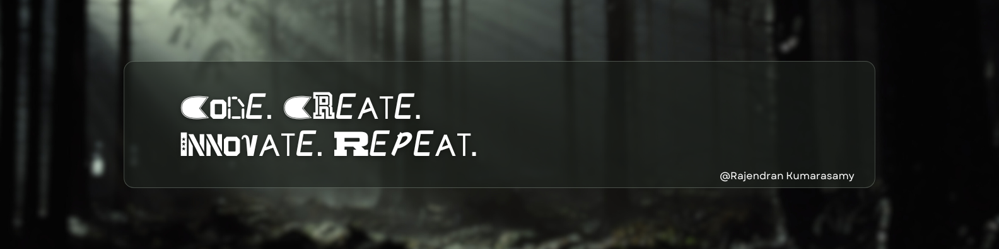

  

###

<h1 align="center">👋 Hi, I'm Rajendran</h1>

###

<h4 align="center">
🚀 Future Data Scientist & AI Engineer  
💡 Deeply interested in exploring how data and AI can solve real-world problems  
🤖 Currently diving deeper into Machine Learning, AI models, and Data Analytics  

🎓 Diploma in ICT (Data Informatics Specialism), Year 2  
🏫 Asia Pacific University of Technology & Innovation (APU)  

🔍 <b>What Drives Me</b>  
- Transforming raw data into meaningful insights  
- Building intelligent, automated systems  
- Exploring cutting-edge AI applications  

🌱 <b>Currently Learning</b>  
`Python` | `R` | `SQL` | `Tableau` | `Power BI`  

📌 <b>Career Goal</b>  
Seeking internship opportunities where I can apply my data skills and grow as a future AI professional.
</h4>

###

  
  
  

###

  
  
  
  
  
  
  
  
  
  
  
  
  
  
  
  
  
  
  
  
  
  
  

###

  <picture>
    <source media="(prefers-color-scheme: dark)" srcset="https://raw.githubusercontent.com/rajen05/rajen05/output/pacman-contribution-graph-dark.svg">
    <source media="(prefers-color-scheme: light)" srcset="https://raw.githubusercontent.com/rajen05/rajen05/output/pacman-contribution-graph.svg">
    
  </picture>

Update on 2025-09-17 09:10:00
